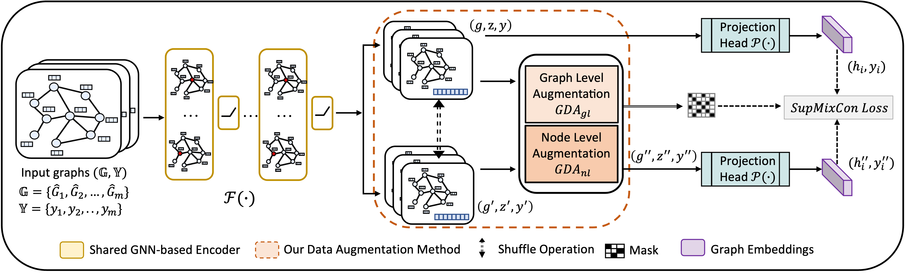

# Efficient and Effective Augmentation Framework with Latent Mixup and Label-Guided Contrastive Learning for Graph Classification
## Introduction
Graph Neural Networks (GNNs) with data augmentation obtain promising results among existing solutions for graph classification. Mixup-based augmentation methods for graph classification have already achieved state-of-the-art performance. However, existing mixup-based augmentation methods either operate in the input space and thus face the challenge of balancing efficiency and accuracy, or directly conduct mixup in the latent space without similarity guarantee, thus leading to lacking semantic validity and limited performance. To address these limitations, this paper proposes $\mathcal{G}$-MixCon, a novel framework leveraging the strengths of \textit{\underline {Mix}}up-based augmentation and supervised \textit{\underline {Con}}trastive learning (SCL). 

To the best of our knowledge, this is the first attempt to develop an SCL-based approach for learning graph representations. Specifically, the mixup-based strategy within the latent space during the contrastive learning process is investigated. $GDA_{gl}$ and $GDA_{nl}$ are proposed, which can linearly interpolate between views at either the node or graph level thus achieving a time complexity of $O(d)$ and $O(k\log n)$, respectively. By comparison, the existing best-accuracy method achieves complexity of $O(n^2)$. Furthermore, we design a dual-objective loss function named $SupMixCon$ that can consider both the consistency among graphs and the distances between the original and augmented graph within the latent space. $SupMixCon$ can guide the training process for supervised contrastive learning in $\mathcal{G}$-MixCon while achieving a similarity guarantee. Comprehensive experiments are conducted on datasets from varied domains and sizes, using different GNN architectures. Experimental results show that $\mathcal{G}$-MixCon not only demonstrably enhances performance, achieving an average accuracy increment of 6.24\%, but also significantly increases the robustness of GNNs against noisy labels. 



## Run
### 1. Requirements
```
pytorch==1.13
cuda==11.6
torch_geometric==2.3.1
python==3.9
```
### 2. To install torch-geometric==2.3.1
```
pip install torch-cluster==1.6.1+pt113cu116
pip install torch-scatter==2.1.1+pt113cu116
pip install torch-sparse==0.6.17+pt113cu116
pip install torch-spline-conv==1.2.2+pt113cu116
pip install torch_geometric==2.3.1
```
### 3. To install dgl-cuda11.6
```
conda install dglteam::dgl-cuda11.6
```


### 4. Data 
We use the dataset built in torch_geometric. The dataset will be downloaded automatically.

### 5. Run Experiments
```
run the run_gmixcon.sh for G-MixCon
```

## Cite Our Paper

